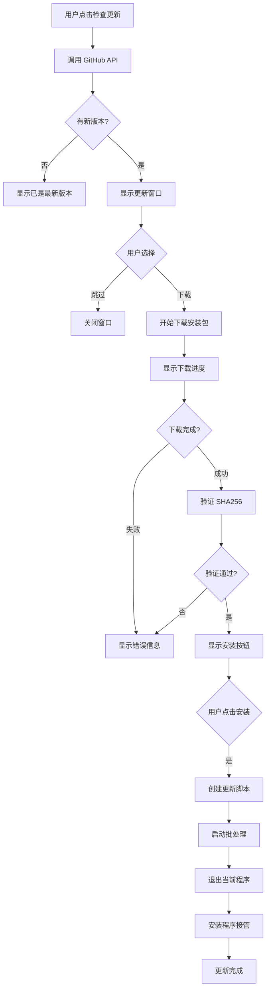

# CTWebPlayer 自动更新流程文档

## 概述
CTWebPlayer 实现了完整的自动更新功能，可以从 GitHub Release 检查新版本、下载安装包并自动更新。

## 版本管理
- 版本号遵循 SemVer 规范（主版本.次版本.修订号）
- 当前版本定义在 [`src/Version.cs`](../src/Version.cs:13-23)
- 版本号示例：1.2.1

## 核心组件

### 1. UpdateManager（更新管理器）
文件：[`src/UpdateManager.cs`](../src/UpdateManager.cs)

主要功能：
- **检查更新**：通过 GitHub API 获取最新版本信息
- **下载更新**：支持断点续传和进度报告
- **文件验证**：通过 SHA256 哈希验证文件完整性
- **应用更新**：创建批处理脚本实现自动更新

### 2. UpdateInfo（更新信息）
文件：[`src/UpdateInfo.cs`](../src/UpdateInfo.cs)

存储更新相关信息：
- 版本号、发布日期、发布说明
- 下载链接、文件大小、SHA256 哈希值
- 是否为强制更新、最小支持版本

### 3. UpdateForm（更新界面）
文件：[`src/UpdateForm.cs`](../src/UpdateForm.cs)

提供用户界面：
- 显示新版本信息和更新说明
- 实时显示下载进度
- 提供下载、安装、跳过等操作按钮

## 更新流程详解

### 第一阶段：检查更新

1. **触发检查**
   - 用户点击菜单："工具" → "检查更新"
   - 代码位置：[`src/Form1.cs:1704`](../src/Form1.cs:1704)

2. **API 调用**
   - 访问 GitHub API：`https://api.github.com/repos/a11s/ctwebplayer/releases/latest`
   - 获取最新版本的 JSON 数据
   - 代码位置：[`src/UpdateManager.cs:54-57`](../src/UpdateManager.cs:54-57)

3. **版本比较**
   - 解析返回的版本号（去除 'v' 前缀）
   - 与当前版本 [`Version.FullVersion`](../src/Version.cs:39) 进行比较
   - 判断是否需要更新

4. **查找安装包**
   - 优先查找名称包含 "setup" 或 "installer" 的 exe 文件
   - 避免下载主程序 exe，确保下载的是安装程序
   - 代码位置：[`src/UpdateInfo.cs:150-195`](../src/UpdateInfo.cs:150-195)

### 第二阶段：下载更新

1. **显示更新窗口**
   - 如果有新版本，显示 [`UpdateForm`](../src/UpdateForm.cs) 窗口
   - 展示版本信息、文件大小、更新说明

2. **下载过程**
   - 使用 Flurl.Http 库进行下载
   - 支持进度报告（通过事件 `DownloadProgressChanged`）
   - 文件保存到临时目录：`%TEMP%\CTWebPlayer_Setup_Update.exe`
   - 代码位置：[`src/UpdateManager.cs:129-211`](../src/UpdateManager.cs:129-211)

3. **文件验证**
   - 从 Release Notes 中提取 SHA256 哈希值
   - 计算下载文件的哈希值并比较
   - 确保文件完整性和安全性
   - 代码位置：[`src/UpdateManager.cs:225-249`](../src/UpdateManager.cs:225-249)

### 第三阶段：应用更新

1. **创建更新脚本**
   - 生成批处理文件 `update.bat`
   - 脚本内容：
     ```batch
     @echo off
     echo 正在启动更新程序...
     timeout /t 2 /nobreak > nul
     start "" "安装程序路径" /SILENT /DIR="程序目录"
     timeout /t 5 /nobreak > nul
     if exist "update.bat" del "update.bat"
     exit
     ```
   - 代码位置：[`src/UpdateManager.cs:279-294`](../src/UpdateManager.cs:279-294)

2. **启动更新**
   - 执行批处理文件
   - 退出当前程序（`Application.Exit()`）
   - 安装程序接管更新过程

## 安装程序集成

### Inno Setup 配置
文件：[`installer/setup.iss`](../installer/setup.iss)

关键配置：
- 默认安装路径：`{localappdata}\CTWebPlayer`（用户目录，无需管理员权限）
- 权限设置：`PrivilegesRequired=none`（普通用户权限）
- 静默安装支持：`/SILENT` 或 `/VERYSILENT` 参数

### 进程管理
安装前检查并关闭运行中的程序：
- 使用 WMI 检测进程：[`installer/setup.iss:214-275`](../installer/setup.iss:214-275)
- 备用方案使用 tasklist/taskkill 命令
- 排除安装程序自身，避免误报

## 错误处理

### 网络错误
- API 请求失败时显示错误消息
- 提供重试机制

### 下载错误
- 支持取消下载操作
- 失败时清理临时文件
- 显示详细错误信息

### 验证错误
- SHA256 验证失败时拒绝安装
- 提示用户重新下载

## 配置和常量

### GitHub API 配置
```csharp
private const string GITHUB_API_URL = "https://api.github.com/repos/a11s/ctwebplayer/releases/latest";
private const string USER_AGENT = "CTWebPlayer-UpdateChecker/1.0";
```

### 临时文件
```csharp
private const string UPDATE_TEMP_FILE = "CTWebPlayer_Setup_Update.exe";
private const string UPDATE_BATCH_FILE = "update.bat";
```

## 多语言支持

更新相关的所有文本都支持多语言：
- 使用 `LanguageManager.Instance.GetString()` 获取本地化字符串
- 支持语言：简体中文、繁体中文、英语、日语、韩语

## 日志记录

所有更新操作都记录到日志：
- 使用 `LogManager.Instance` 记录
- 包括：版本检查、下载进度、错误信息
- 日志文件位置：`logs/` 目录

## 流程图



## 测试要点

1. **版本检查测试**
   - 修改本地版本号测试版本比较逻辑
   - 模拟 API 返回不同版本号

2. **下载测试**
   - 测试大文件下载
   - 测试网络中断恢复
   - 测试取消下载

3. **安装测试**
   - 测试静默安装
   - 测试程序运行时的更新
   - 测试权限不足的情况

4. **回滚测试**
   - 测试更新失败后的回滚
   - 测试保留用户配置

## 注意事项

1. **版本号管理**
   - 发布新版本前必须更新 [`src/Version.cs`](../src/Version.cs) 中的版本号
   - GitHub Release 的 tag 必须与版本号一致（格式：v1.2.3）

2. **发布包要求**
   - Release 必须包含安装程序（名称包含 setup 或 installer）
   - 建议在 Release Notes 中包含 SHA256 哈希值

3. **兼容性考虑**
   - 更新过程保留用户配置文件（config.json）
   - 保留缓存和日志文件
   - 支持从旧版本平滑升级

## 相关文件

- 版本定义：[`src/Version.cs`](../src/Version.cs)
- 更新管理器：[`src/UpdateManager.cs`](../src/UpdateManager.cs)
- 更新信息：[`src/UpdateInfo.cs`](../src/UpdateInfo.cs)
- 更新界面：[`src/UpdateForm.cs`](../src/UpdateForm.cs)
- 主窗体集成：[`src/Form1.cs:1700-1745`](../src/Form1.cs:1700-1745)
- 安装程序：[`installer/setup.iss`](../installer/setup.iss)
- 构建脚本：[`scripts/build.ps1`](../scripts/build.ps1)
- 打包脚本：[`scripts/package.ps1`](../scripts/package.ps1)
- 发布脚本：[`scripts/release.ps1`](../scripts/release.ps1)

## 启动时自动检查更新

### 功能说明
从 v1.2.2 版本开始，CTWebPlayer 支持在程序启动时自动检查更新。这个功能可以确保用户始终使用最新版本。

### 配置选项
在 `config.json` 中的 `update` 节点：
```json
{
  "update": {
    "checkOnStartup": true,        // 是否在启动时检查更新
    "skippedVersion": "",           // 用户跳过的版本号
    "lastCheckTime": "2024-12-17",  // 上次检查时间
    "showStartupTip": true          // 是否显示启动提示
  }
}
```

### 更新通知对话框
文件：[`src/UpdateNotificationDialog.cs`](../src/UpdateNotificationDialog.cs)

当检测到新版本时，会显示一个简洁的通知对话框，包含：
- 当前版本和新版本号对比
- 文件大小和发布日期
- 更新说明预览
- 三个操作选项：
  1. **立即更新**：打开完整的更新窗口进行下载和安装
  2. **跳过此版本**：永久跳过这个版本，不再提醒
  3. **稍后提醒**：关闭对话框，下次启动时再次提醒

### 用户体验设计

1. **非侵入式**
   - 启动后延迟 2 秒才检查，不影响主界面加载
   - 检查间隔限制：至少间隔 1 小时
   - 用户可选择"不再显示"

2. **版本跳过机制**
   - 用户可以选择跳过特定版本
   - 跳过的版本记录在配置文件中
   - 仍可通过手动检查更新来安装跳过的版本

3. **强制更新支持**
   - 如果是强制更新，禁用"跳过"和"稍后提醒"按钮
   - 显示红色提示文字说明必须更新

### 实现细节

1. **检查时机**
   - 在 WebView2 初始化完成后异步执行
   - 不阻塞主界面的加载和显示

2. **错误处理**
   - 网络错误静默处理，不显示错误对话框
   - 仅记录到日志文件中
   - 不影响程序正常运行

3. **性能优化**
   - 异步执行，不影响启动速度
   - 缓存上次检查时间，避免频繁请求

## 更新历史

- v1.2.2 - 添加启动时自动检查更新功能
- v1.2.1 - 当前版本
- v1.2.0 - 添加自动更新功能
- v1.0.0 - 初始版本

---

最后更新：2024-12-17