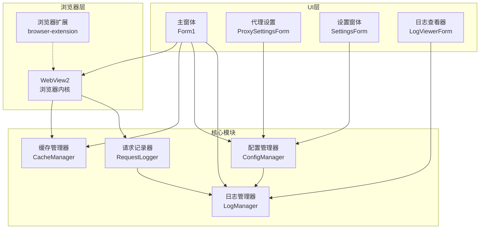
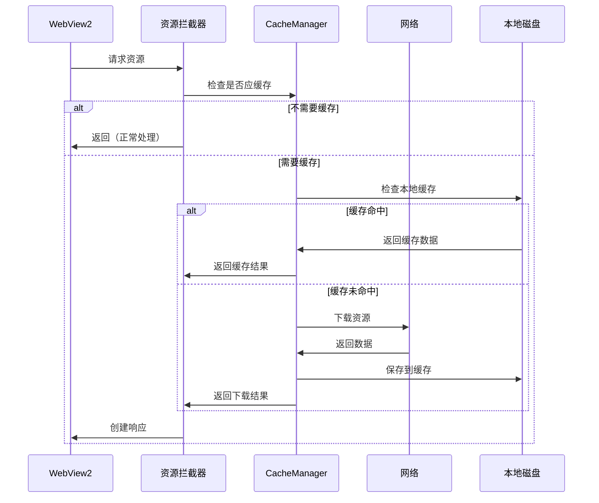
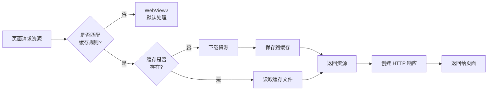
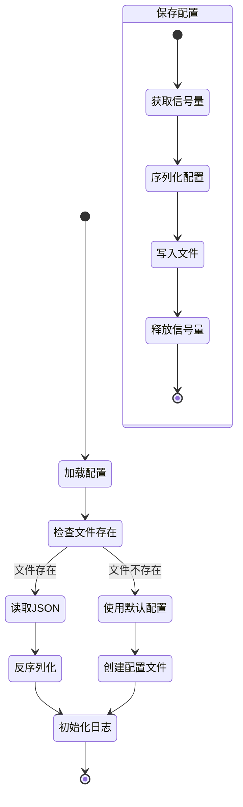

# CTWebPlayer 技术架构文档

## 1. 项目架构概述

### 1.1 技术栈说明

CTWebPlayer 是一个专为 Unity3D WebPlayer 游戏优化的桌面浏览器应用，采用以下技术栈：

- **开发语言**: C# (.NET Framework)
- **UI 框架**: Windows Forms
- **浏览器内核**: Microsoft Edge WebView2
- **开发工具**: Visual Studio
- **目标平台**: Windows 10/11

### 1.2 整体架构设计理念

项目采用分层架构设计，遵循单一职责原则，主要设计理念包括：

1. **模块化设计**: 各功能模块独立封装，降低耦合度
2. **缓存优先**: 通过智能缓存机制减少网络请求，提升加载速度
3. **配置驱动**: 通过配置文件管理应用行为，提高灵活性
4. **异步处理**: 采用异步编程模型，确保 UI 响应性
5. **日志追踪**: 完善的日志系统，便于问题定位和性能分析

### 1.3 模块间的交互关系



## 2. 核心模块详解

### 2.1 CacheManager - 缓存管理器

**职责**: 管理静态资源的本地缓存，减少网络请求，提升加载速度。

**关键特性**:
- 支持多种文件类型缓存（JS、CSS、图片、字体、Unity 资源等）
- 支持基于路径的缓存规则（如 `/patch/files/` 路径）
- 并发下载控制，防止重复下载
- 自动创建目录结构，镜像 URL 路径

**核心方法**:
```csharp
// 检查 URL 是否应该被缓存
public bool ShouldCache(string url)

// 获取缓存文件路径
public string GetCacheFilePath(string url)

// 从缓存读取资源
public async Task<CacheResult> GetFromCacheAsync(string url)

// 下载并缓存资源
public async Task<CacheResult> DownloadAndCacheAsync(string url)
```

### 2.2 ConfigManager - 配置管理器

**职责**: 管理应用程序配置，提供统一的配置读写接口。

**配置结构**:
```json
{
  "proxy": {
    "enabled": false,
    "http_proxy": "http://127.0.0.1:7890",
    "https_proxy": "http://127.0.0.1:7890",
    "socks5": "127.0.0.1:7890"
  },
  "logging": {
    "enabled": true,
    "logLevel": "Info",
    "maxFileSize": 10485760
  },
  "enableAutoIframeNavigation": true,
  "ui": {
    "windowWidth": 1236,
    "windowHeight": 740
  },
  "debugMode": false
}
```

**关键功能**:
- 异步/同步配置保存
- 代理设置管理
- 日志级别配置
- UI 尺寸配置
- 线程安全的配置访问

### 2.3 Form1 - 主窗体

**职责**: 应用程序主界面，集成 WebView2 浏览器控件。

**核心功能**:
- WebView2 初始化和配置
- 资源请求拦截和缓存处理
- CORS 策略处理
- Unity WebGL 游戏优化
- 导航控制和状态显示

**关键方法**:
```csharp
// 配置资源拦截
private void ConfigureResourceInterception()

// 处理资源请求（缓存逻辑）
private async void CoreWebView2_WebResourceRequested(...)

// 注入 CORS 处理脚本
private async Task InjectCorsHandlingScript()

// Unity canvas 全屏处理
private async Task CheckAndHandleUnityCanvas()
```

### 2.4 LogManager - 日志管理器

**职责**: 提供统一的日志记录服务，支持日志分级、异步写入和文件轮转。

**设计模式**: 单例模式

**特性**:
- 异步日志写入，不阻塞主线程
- 日志缓冲队列，批量写入提高性能
- 自动文件轮转，防止日志文件过大
- 支持日志级别过滤
- 线程安全

### 2.5 RequestLogger - 请求记录器

**职责**: 记录 HTTP 请求详情，用于调试和性能分析。

**记录内容**:
- 请求 URL
- 缓存状态（HIT/MISS/ERROR）
- 响应大小
- 下载时间
- 缓存文件路径

## 3. 技术实现细节

### 3.1 WebView2 集成方式

WebView2 初始化配置：

```csharp
// 浏览器参数配置
var browserArgs = new List<string>
{
    "--disable-web-security",                    // 禁用 CORS
    "--disable-features=IsolateOrigins",         // 禁用源隔离
    "--allow-running-insecure-content",          // 允许不安全内容
    "--allow-file-access-from-files",            // 允许文件访问
    "--ignore-certificate-errors"                // 忽略证书错误
};

// 创建 WebView2 环境
var environment = await CoreWebView2Environment.CreateAsync(
    null, 
    userDataFolder, 
    options
);
```

### 3.2 缓存机制的实现原理

缓存工作流程：



### 3.3 代理服务器的配置和应用

代理配置通过 WebView2 的命令行参数实现：

```csharp
// 获取代理配置
var proxyString = _configManager.GetProxyString();
if (!string.IsNullOrEmpty(proxyString))
{
    browserArgs.Add($"--proxy-server={proxyString}");
}
```

支持的代理类型：
- HTTP/HTTPS 代理
- SOCKS5 代理

### 3.4 请求拦截和日志记录

请求拦截通过 WebView2 的 `WebResourceRequested` 事件实现：

1. 添加资源过滤器，拦截所有请求
2. 在事件处理器中判断是否需要缓存
3. 处理缓存逻辑，返回自定义响应
4. 记录请求日志供分析使用

## 4. 数据流程

### 4.1 HTTP 请求的处理流程



### 4.2 缓存查询和存储流程

缓存文件组织结构：
```
./cache/
├── hefc.hrbzqy.com/
│   └── patch/
│       └── files/
│           └── assets_resources_*.data
├── cdn.example.com/
│   ├── js/
│   │   └── app_v1.2.3.js
│   └── css/
│       └── style_v2.0.1.css
```

### 4.3 配置加载和保存流程



## 5. 扩展性设计

### 5.1 如何添加新的缓存规则

1. **修改 `ShouldCache` 方法**：
```csharp
public bool ShouldCache(string url)
{
    var uri = new Uri(url);
    var path = uri.AbsolutePath.ToLower();
    
    // 添加新的路径规则
    if (path.Contains("/your-custom-path/"))
    {
        return true;
    }
    
    // 添加新的扩展名
    _cacheableExtensions.Add(".newext");
    
    // 现有逻辑...
}
```

2. **更新 MIME 类型映射**（如需要）：
```csharp
private string GetMimeType(string filePathOrUrl)
{
    var extension = Path.GetExtension(filePathOrUrl).ToLower();
    return extension switch
    {
        ".newext" => "application/your-type",
        // 其他映射...
    };
}
```

### 5.2 如何扩展功能模块

1. **创建新的管理器类**：
   - 继承或实现必要的接口
   - 使用单例模式（如需要）
   - 在主窗体中初始化

2. **添加新的窗体**：
   - 创建 Windows Forms 窗体
   - 在主窗体中添加触发入口
   - 通过 ConfigManager 保存设置

3. **扩展 WebView2 功能**：
   - 订阅相关事件
   - 注入自定义 JavaScript
   - 添加新的请求拦截规则

### 5.3 浏览器扩展的集成方式

浏览器扩展通过独立的 Chrome Extension 实现，主要功能：

1. **资源缓存**: 使用 IndexedDB 存储资源
2. **请求拦截**: 通过 `chrome.webRequest` API
3. **性能监控**: 统计缓存命中率
4. **Native Messaging**: 与主程序通信

集成方式：
- 扩展独立运行在浏览器中
- 通过 Native Messaging 与 C# 程序通信
- 共享缓存策略和配置

## 6. 开发指南

### 6.1 开发环境要求

- **操作系统**: Windows 10 或更高版本
- **开发工具**: Visual Studio 2019 或更高版本
- **.NET Framework**: 4.7.2 或更高版本
- **WebView2 Runtime**: 最新版本
- **硬件要求**: 
  - CPU: 双核 2GHz 以上
  - 内存: 4GB 以上
  - 硬盘: 至少 1GB 可用空间

### 6.2 项目构建说明

1. **克隆项目**：
```bash
git clone https://github.com/your-repo/ctwebplayer.git
cd ctwebplayer
```

2. **打开解决方案**：
   - 使用 Visual Studio 打开 `ctwebplayer.sln`

3. **还原 NuGet 包**：
   - 在解决方案资源管理器中右击解决方案
   - 选择"还原 NuGet 包"

4. **配置 WebView2**：
   - 确保已安装 WebView2 Runtime
   - NuGet 包会自动下载 WebView2 SDK

5. **构建项目**：
   - 选择 Release 或 Debug 配置
   - 按 F6 或选择"生成" -> "生成解决方案"

6. **运行项目**：
   - 按 F5 启动调试
   - 或在输出目录运行 `ctwebplayer.exe`

### 6.3 调试技巧

1. **启用调试模式**：
   在 `config.json` 中设置：
   ```json
   {
     "debugMode": true
   }
   ```

2. **查看请求日志**：
   - 调试模式下会生成 `request.log`
   - 记录所有资源请求和缓存状态

3. **使用 WebView2 开发者工具**：
   - 右击页面选择"检查"
   - 或按 F12 打开开发者工具

4. **日志级别调整**：
   ```json
   {
     "logging": {
       "logLevel": "Debug"
     }
   }
   ```

5. **缓存调试**：
   - 查看 `./cache` 目录结构
   - 使用日志查看器查看缓存命中情况
   - 清理缓存测试下载流程

6. **性能分析**：
   - 使用 Visual Studio 性能分析器
   - 监控内存使用和 CPU 占用
   - 分析请求日志中的下载时间

## 总结

CTWebPlayer 通过精心设计的模块化架构，实现了高效的 Unity WebGL 游戏加载优化。主要特点包括：

- **智能缓存系统**：显著减少重复资源下载
- **灵活的配置管理**：支持多种自定义选项
- **完善的日志系统**：便于问题诊断和性能优化
- **CORS 问题解决**：自动处理跨域限制
- **良好的扩展性**：易于添加新功能

项目持续优化中，欢迎贡献代码和提出改进建议。